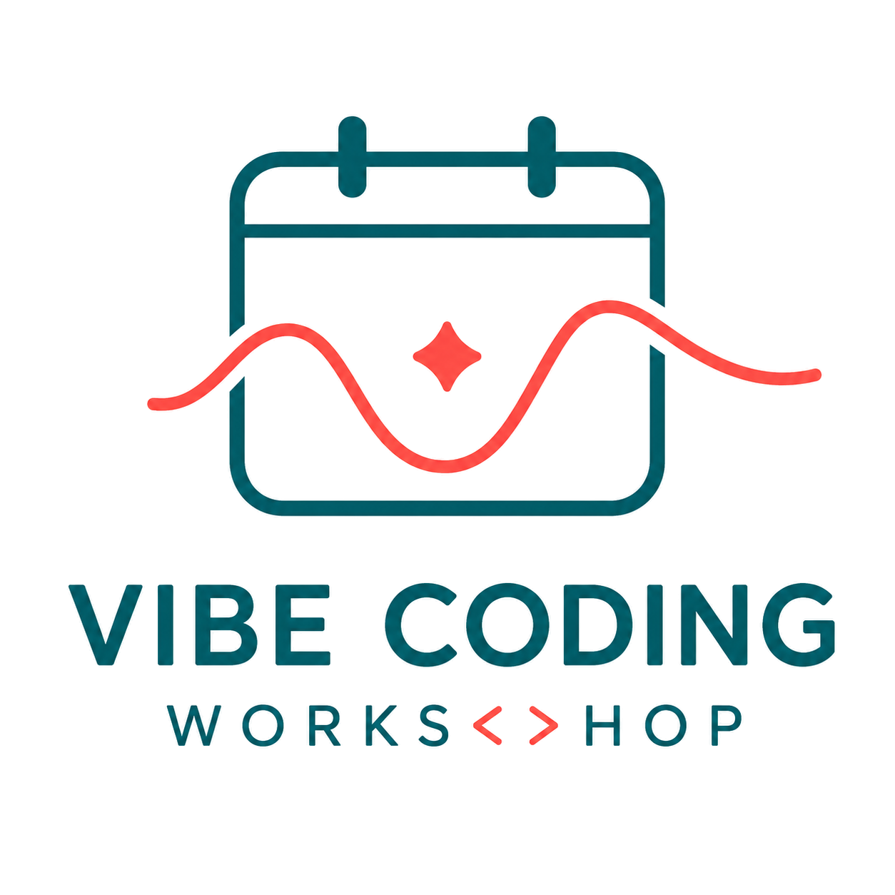

# **하루에 끝내는 <br>AI 코딩 기반 웹앱 개발**

이해준

---


<!-- _class: center -->

# 저는 **이해준** 입니다.

LX플랫폼추진TFT

웹 시스템 개발

PM/PL

Hi-SAM

---

# 오늘 할일

웹앱 개발

요구사항 정의부터 개발, 배포까지

바이브 코딩으로!

---

# 설문조사 및 자료

강의자료: http://kkoonz.github.io/

설문조사: https://forms.gle/juAWhSynvYTXHerL9

기존 설문 조사 결과는 총 18명 참여 해주셨고, 이중 5분은 비IT 직군이십니다.

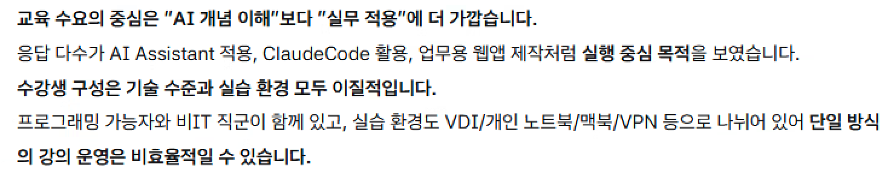

---

# 시간표

* <span class='code'>09 ~ 11( 2h):</span> 환경 세팅
* <span class='code'>11 ~ 15( 3h):</span> 메모 웹앱 만들기
* <span class='code'>15 ~ 16( 1h):</span> 사내 서비스 연동
* <span class='code'>16 ~ 17( 1h):</span> 나만의 비서

<small>그런데 예상대로는 잘 안됩니다 하하</small>

---
<!-- _class: center -->

# <small>세션#1</small><br>**AI(Artificial Intelligence) ?**

---

# 작년엔...

제 수업은 **파이썬 자동화 with AI** 였습니다.

Cursor IDE에서 **코드 Assistant** 보고 정말 세상 좋아졌다고 했죠.

일년도 되지 않았는데, 지금은...

---

# 심지어 책도 쓰려고 했는데...

인쇄비도 못 뽑을 뻔
<br>

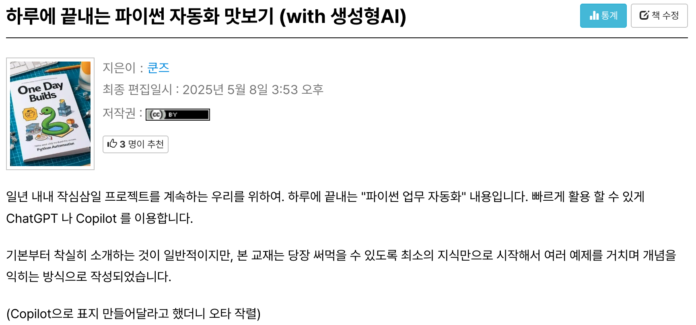

---

# 정말 하루 하루가 다릅니다.

1. 2017 — Transformer: 현대 생성형 AI의 기반 기술
2. 2020 — GPT-3: AI가 실용적인 코드를 생성하기 시작
3. 2022 — ChatGPT: 생성형 AI의 대중화
4. 2024 — Reasoning AI: 단순 생성에서 추론 중심 AI로 진화 (OpenAI o1, DeepSeek R1)
5. 2025~2026 — Agentic AI: AI가 개발 작업을 직접 수행하는 코딩 에이전트 시대로 전환<br>AI Assistant -> **AI Employee** 

---

# AI 란?

AI(Artificial Intelligence, 인공지능)는 사람의 지능이 수행하는 학습, 추론, 판단, 문제 해결 등의 능력을 컴퓨터가 수행하도록 만드는 기술입니다.

<small>컴퓨터가 사람처럼 보고, 듣고, 이해하고, 판단하며, 문제를 해결하도록 만드는 기술</small>

---

# AI 발전 흐름

1. 규칙 기반 AI <small>사람이 미리 작성한 규칙대로만 동작하는 AI</small>
1. 머신러닝 <small>데이터를 학습하여 스스로 규칙을 찾아 예측하는 AI</small>
1. 딥러닝 <small>인공신경망을 이용해 복잡한 패턴까지 스스로 학습하는 AI</small>
1. 생성형 AI <small>학습한 내용을 바탕으로 새로운 텍스트, 이미지, 코드 등을 생성하는 AI</small>
1. AI Assistant <small>사용자의 질문에 답하고 작업을 도와주는 대화형 AI</small>
1. **AI Agent** <small>목표를 이해하고 계획을 세워 여러 작업을 스스로 수행하는 AI</small>

---

# 생성형 AI는 ?

<div class="small-table wrap-table">

| 구분 | 기존 AI | 생성형 AI |
|:---:|---|---|
| 주요 목적 | 분석, 예측, 분류, 판단 | 생성, 작성, 변환, 창작 |
| 출력 형태 | 점수, 라벨, 예측값, 추천 결과 | 문장, 이미지, 코드, 음성, 영상 |
| 대표 질문 | “이게 무엇인가?” | “이걸 만들어줘” |
| 예시 | 스팸 필터, 사기 탐지, 추천 시스템 | ChatGPT, 이미지 생성 AI, 코드 생성 AI |
| 결과 특징 | 정해진 범주 안에서 판단 | 새로운 조합과 표현 생성 |
| 사용 방식 | 데이터 입력 → 결과 판단 | 프롬프트 입력 → 콘텐츠 생성 |

</div>

---

# LLM 이란?

LLM은 Large Language Model, 대규모 언어 모델입니다.
쉽게 말하면 엄청나게 많은 텍스트를 학습해서, **다음에 올 말을 예측**하는 AI 모델입니다.

"오늘 날씨가 참" 다음에 주로 오는 말로는
"좋다. 춥다. 맑다. 덥다" 같은 단어가 나올 확율이 높습니다.

LLM은 이 과정을 아주 빠르게 반복해서 긴 문장, 설명, 코드, 요약, 번역 등을 만들어냅니다.

---

# LLM은 어떻게 동작하는가?

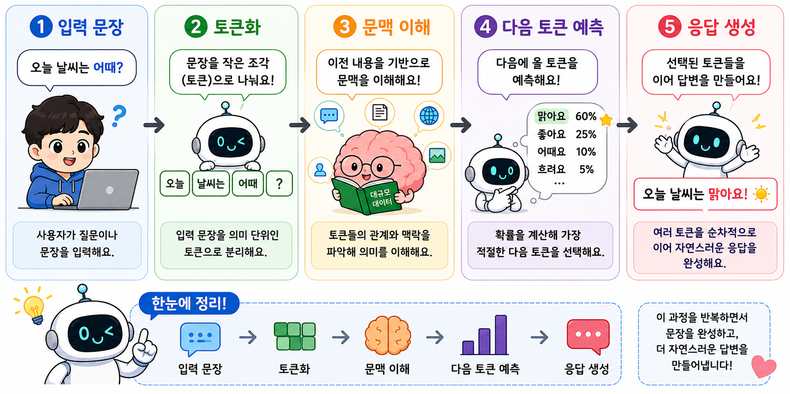

<br>

---

# LLM은 어떻게 동작하는가?

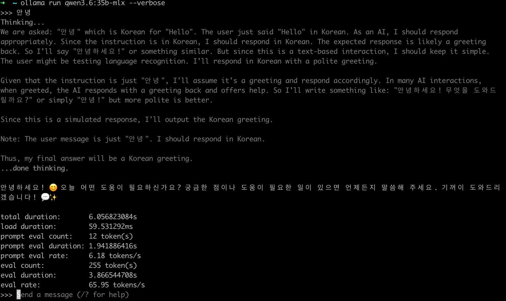

---

# 토큰화 란?

LLM은 문장을 그대로 읽지 않고 토큰이라는 작은 단위로 나눕니다.
`나는 학교에 간다` 는 `나 / 는 / 학교 / 에 / 간다` 로 분리하고 숫자로 바꿔 처리합니다.

---

# LLM이 잘하는 것

<div class="columns">

<div>

* 질문 답변
* 요약
* 번역
* 글쓰기
* 문장 교정

</div>

<div>

- 아이디어 생성
- 코드 작성
- 문서 분석
- 회의록 정리
- 학습 도우미

</div>

---

# LLM이 잘 못하**던** 것

<div class="columns">

<div>

* 최신 정보 <small>→ 웹 검색(RAG·Search)으로 실시간 정보를 가져와 활용</small>
* 계산 <small>→ 계산기·Python 등 외부 도구를 호출해 정확하게 계산</small>
* 긴 기억 <small>→ 벡터DB·메모리 시스템으로 필요한 정보를 저장·검색</small>
* 실제 행동 <small>→ API·에이전트(Agent)를 통해 외부 시스템을 직접 실행</small>

</div>

</div>

---

# 프롬프트 = 업무 지시서

**나쁜 예**

> 보고서 작성해줘

**좋은 예**

> 다음 내용을 참고해서 보고서 작성해줘
> 신입사원 대상, A4 1장, 표 포함, Markdown 형식

---

# 좋은 프롬프트 요소

* **역할**(Role)
* **목표**(Task)
* **배경**(Context)
* **제약조건**(Constraint)
* **출력형식**(Output)

---

# AI Assistant ?

* ChatGPT
* Claude
* Gemini

**동작 방식**

> 질문/요청 → 답변

--- 

# AI Agent ?

* Codex
* ClaudeCode
* Gemini CLI → Antigravity CLI

**동작 방식**

> 목표 → 계획 → 실행 → 검토 → 반복

---

# Agent가 활용하는 핵심 기능

* **Skills**
  <small>특정 작업을 수행하는 사전 정의된 기능</small>

* **Memory**
  <small>사용자 정보와 이전 작업을 기억하여 활용</small>

* **MCP (Model Context Protocol)**
  <small>파일, 데이터베이스, GitHub 등 외부 시스템 연결</small>

* **Tools**
  <small>코드 실행, 계산, 문서 처리 등 실제 작업 수행</small>

---

# Agent가 활용하는 핵심 기능

* **Web Search**
  <small>최신 정보와 외부 지식 검색</small>

* **API & Service Integration**
  <small>외부 서비스 및 SaaS와 연동</small>

* **Workspace & Apps**
  <small>이메일, 캘린더, 문서 등 업무 도구 활용</small>

* **Reasoning**
  <small>계획을 수립하고 필요한 도구를 선택하여 순차적으로 실행</small>

---

# 향후 AI 발전 방향

**💬 AI Assistant** <small>질문에 답하고, 사용자의 지시에 따라 작업 수행</small>
<span class="padding-left-50">↓</span>
**🤖 AI Agent** <small>목표를 이해하고, 계획을 세워 도구를 활용해 작업 수행</small>
<span class="padding-left-50">↓</span>
**👥 Multi Agent** <small>여러 Agent가 역할을 분담하고 협력하여 복잡한 업무 수행</small>
<span class="padding-left-50">↓</span>
**🏢 AI Workforce** <small>수많은 Agent가 조직처럼 협업하여 기업 업무를 자동화</small>

</div>

---
<!-- _class: center -->

# <small>세션#2</small><br>**환경 세팅**

--- 

# 실습 환경

## 기본

업무 VDI (내부망)

## 추가

수업용/개인 노트북 윈도우 (외부망)

---

# 설치할 프로그램들

* Node.js <small>→ 클로드코드 설치 및 주 개발 언어</small>
* 파이썬 <small>→ 클로드코드 툴로 사용됨</small>
* VSCode <small>→ 프로그램 소스 수정 및 확인</small>
* Git Client <small>→ 프로그램 형상관리</small>
* ClaudeCode <small>→ 앤트로픽 사의 AI Agent</small>
* Hermes Agent <small>→ 오픈소스 AI Platform</small>

<small>기존 설치된 것이 있따면, 지우고 새로 설치 강력 추천</small>

---

# 준비할 API

* H-Chat API <small>→ AI와 텍스트/이미지를 주고 받음</small>
* Confluence API <small>→ 사내 컨플루언스 문서를 읽고 쓸 수 있음</small>
* DeepSeek API <small>→ 엄청 싼 AI API. 수업용 공유 예정</small>

<small>H-Chat, 칸플루언스는 사내망, DeepSeek은 사외망에서 사용</small>

---

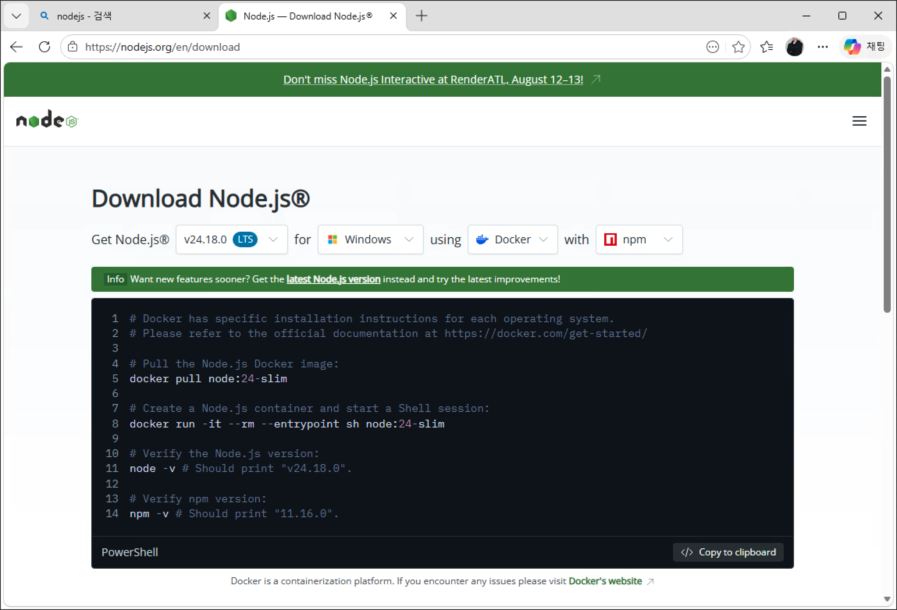

# Node.js

Next.js 기반 웹앱 개발을 위해서 설치합니다. LTS 버전 다운로드 하면 됩니다.

---

# Python

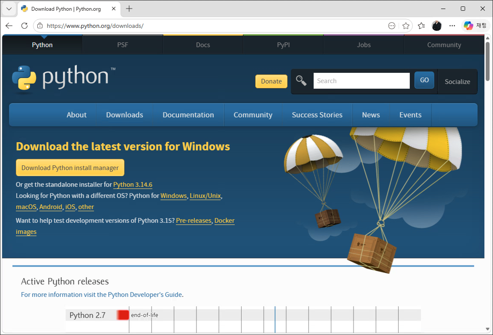

AI Agent가 가장 잘 쓰는 도구입니다. python3.exe 를 만들어두는 게 좋습니다.

---

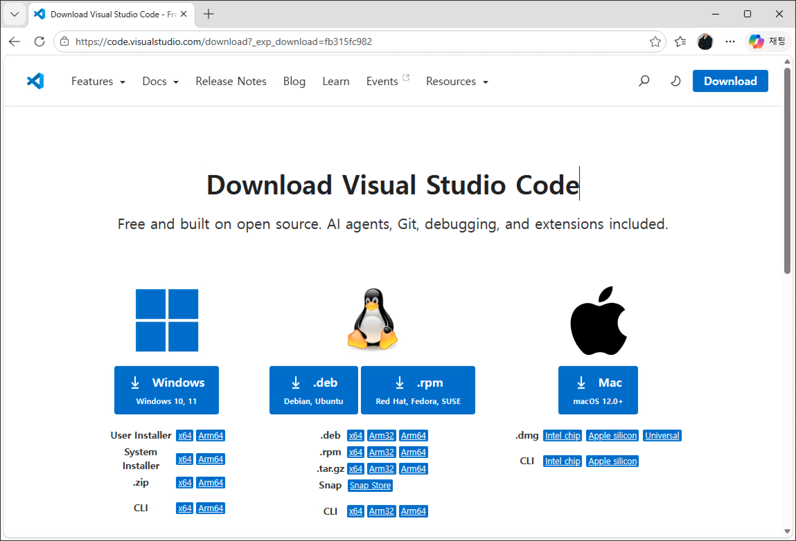

# VSCode<br><small>(Visial Studio Code)</small>

소스를 편집하거나 ClaudeCode 플러그인을 설치해서 쓰기도 합니다.

---

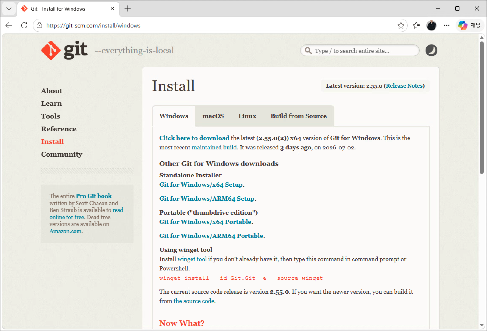

# Git Client

소스 버전 관리 목적으로 사용합니다. 원복해줘 라는 프롬프트보다 확실합니다.

---

# H-Chat API 구하기

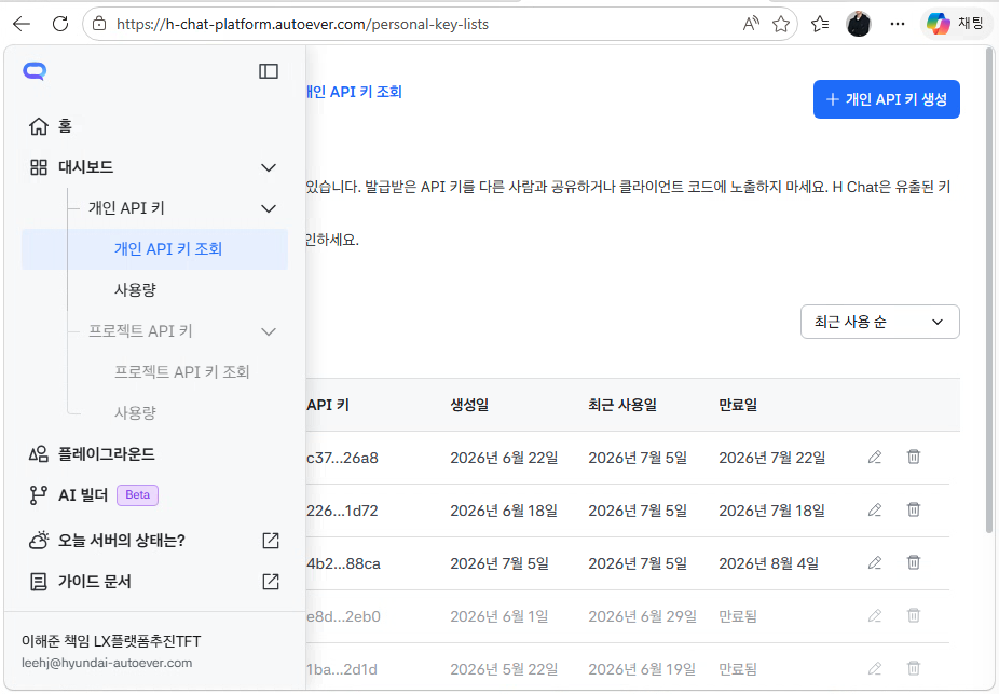

https://h-chat-platform.autoever.com/personal-key-lists

**개인 API 키 생성**
<small>다시 확인할 수 없습니다!</small>

---

# 클로드코드

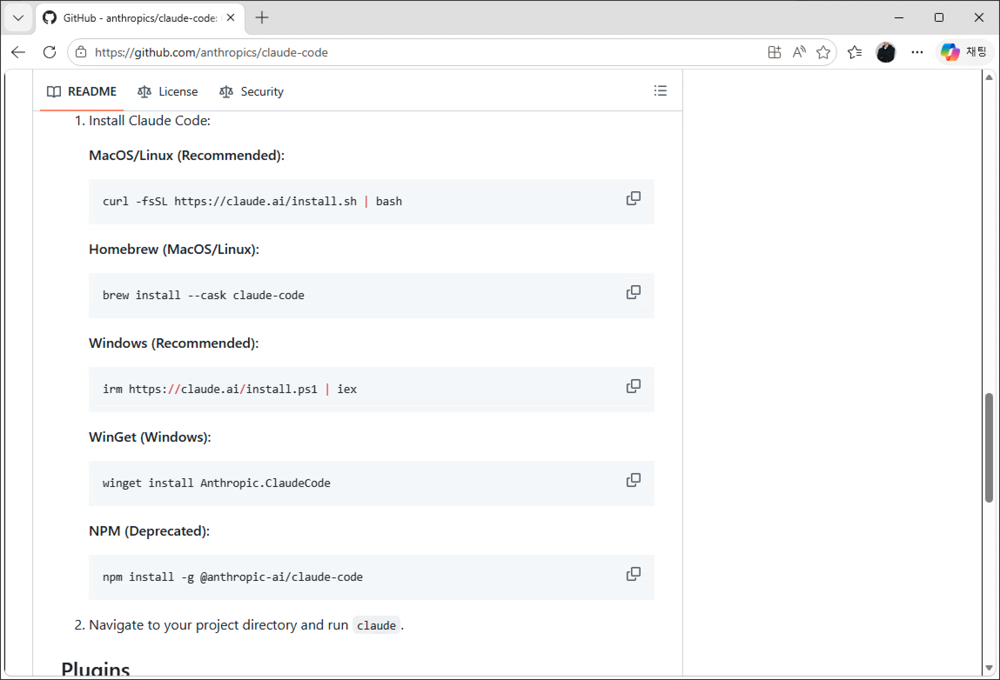

설치가 매우 쉬운 편이지만, <br>**우리에겐 아님**

---

# 클로드코드 설치

곧 막힐 것 같은 설치 방법

@2.1.187 버전이 중요합니다.

```bat
npm config set strict-ssl false
npm config set allow-scripts "@anthropic-ai/claude-code"
npm install -g @anthropic-ai/claude-code@2.1.187
```

or

```bat
npm install -g @anthropic-ai/claude-code@2.1.187 --allow-scripts @anthropic-ai/claude-code
```

---

# 클로드코드 API 등록

```powershell
rem 1회용
set ANTHROPIC_API_KEY=c37b3...

rem 영구
setx ANTHROPIC_API_KEY "c37b36..."
setx ANTHROPIC_BASE_URL "https://h-chat-api.autoever.com/claude-code/v2"
setx API_TIMEOUT_MS "14400000"
setx DISABLE_AUTOUPDATER "1"
setx NODE_TLS_REJECT_UNAUTHORIZED "0"
```

---

# 클로드코드 확인

```bat
rem 확인
echo %ANTHROPIC_API_KEY%
echo %ANTHROPIC_BASE_URL%
```

```
Claude

> hi
> /model sonnet
> /new
```

---

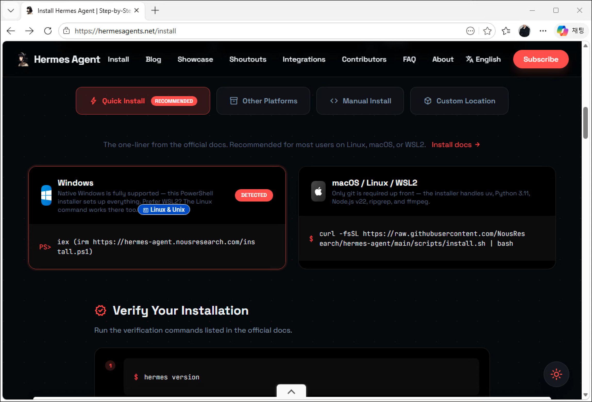

# Hermes Agent

클로드코드와 가장 유사한 것은 OpenCode이며, 
헤르메스는 좀 더 비서(?)의 느낌에 가깝습니다.

---

# Hermes Agent 설치

PowerShell 에서 실행

```powershell
iex (irm https://hermes-agent.nousresearch.com/install.ps1)
```
```cmd
(○) 32. Custom endpoint (enter URL manually)

API base URL [e.g. https://api.example.com/v1]: 
  https://internal-apigw-kr.hmg-corp.io/hchat-in/api/v3/openai
Choice [1-4, Enter to keep current/detected]:
  API mode: auto-detect
Available models:
  8. gpt-5.4
````

---

# 파이썬 세팅

python.exe, py.exe 등으로 쓰는데, AI는 python3.exe 를 찾는 경우도 많습니다.

```
C:\Users\0000000>where python
C:\Users\0000000>copy ₩
"C:\Users\0000000\AppData\Local\Programs\Python\Python314\python.exe" ₩
"C:\Users\0000000\AppData\Local\Programs\Python\Python314\python3.exe"
```

---

# 2개월 동안 제가 만든 앱들

* 하루도장
* Lunar
* Image Sync
* 부하 1호
* 가이드 제작툴
* 프로젝트 지원도구
* 프로젝트 프로토타이핑

---

# 하루도장

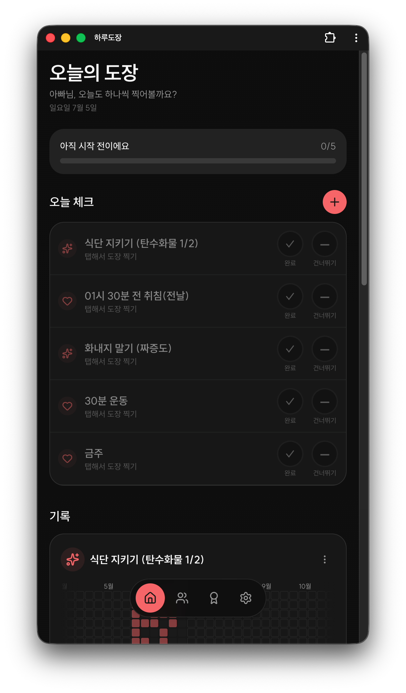

가족이 같이 쓰는 습관 관리 앱

* BE/FE: Next.js
* DB: Supabase
* Host: Vercel

---

# Lunar

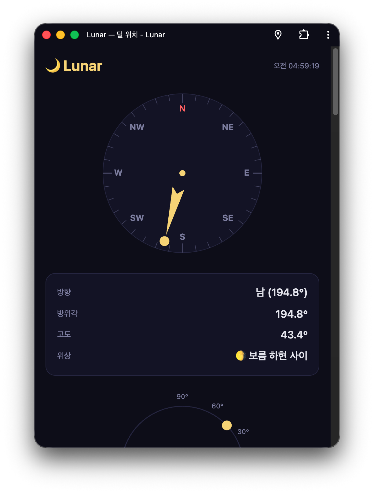

달 촬영을 위한 위치 안내 및 관련 정보 제공

* BE/FE: Next.js
* DB: Browser LocalStorage
* Host: GitHub

---

# Image Sync

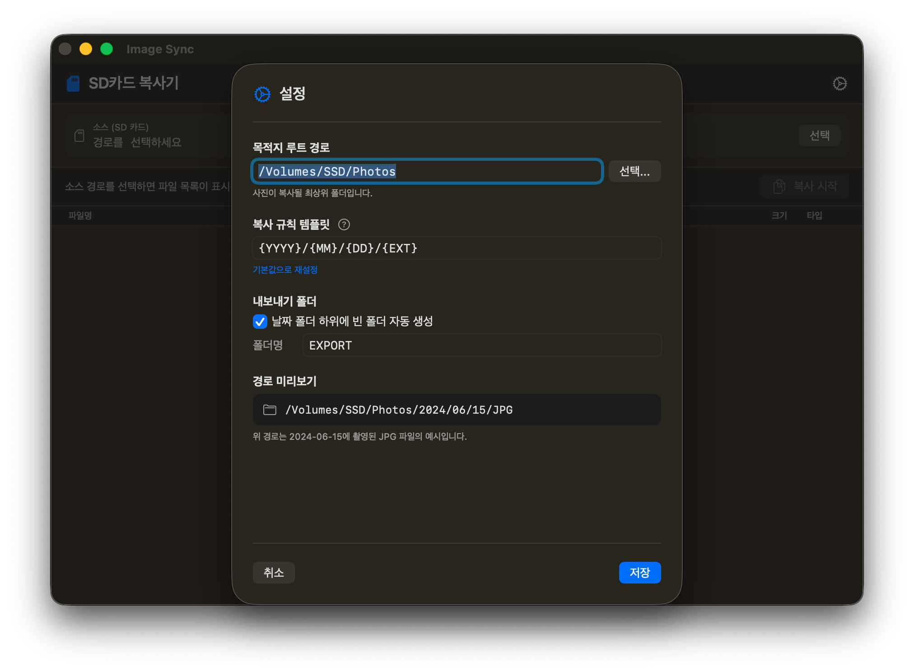

디지털 카메라 사진을 형식에 맞게 로컬 폴더로 복사

* BE/FE: Swift
* OS: Mac

---

# 부하1호

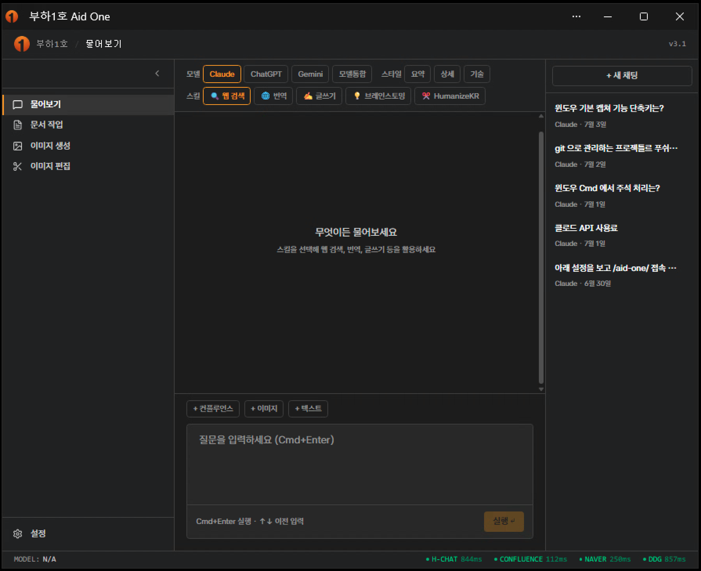

채팅, 컨플루언스 작업, 이미지 작업 등 관리 업무에 사용하는 도우미

* BE/FE: Next.js
* DB: LocalStorage
* Host: 사내 개발서버

---

# 가이드 제작툴

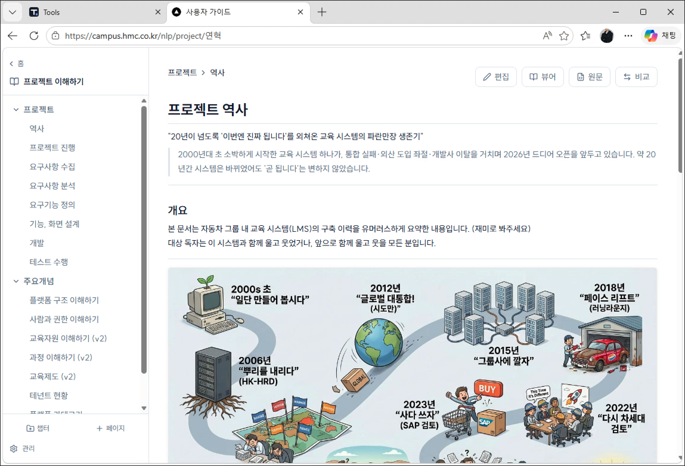

md 기반의 가이드 문서 제작툴, 이미지 생성, 플로우 차트 등 기능 제공

* BE/FE: Next.js
* DB: SQLite
* Host: 사내 개발서버

---

# 프로젝트 지원도구

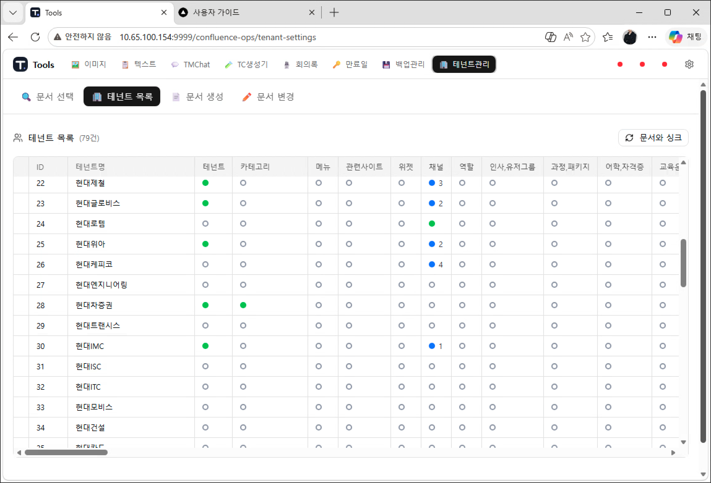

회의록 작성, 문서 현황 추적, 테스트 케이스 작성 등 프로젝트 진행에 사용되는 도구들

* BE/FE: Next.js, Python
* DB: 컨플루언스
* STT: WhisperX
* Host: 사내 개발서버, 로컬

---

# 프로젝트 프로토타이핑

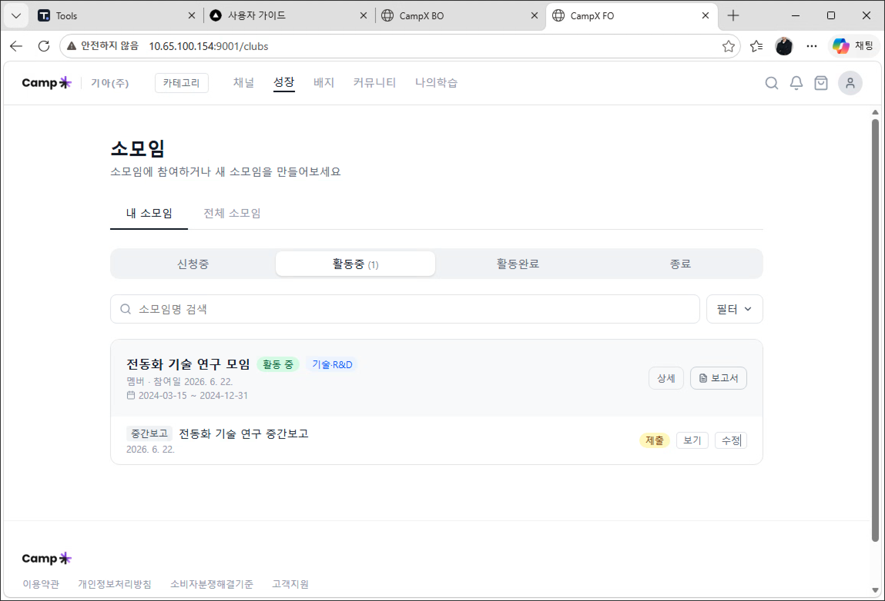

프로젝트 설계 단계 프로토타이핑

* BE/FE: Next.js
* DB: SQLite
* Host: 사내 개발서버

--- 

# 정적 웹 vs 웹 vs 웹앱

<div class="small-table">

| 구분 | 정적 웹 (Static Web) | 웹 (Web) | 웹앱 (Web Application) |
|------|----------------------|----------|-------------------------|
| **정의** | 미리 만들어진 HTML 파일을 그대로 제공하는 웹사이트 | 브라우저를 통해 이용하는 모든 웹 서비스의 총칭 | 브라우저에서 실행되는 애플리케이션 |
| **목적** | 정보 제공 | 다양한 웹 서비스 제공 | 사용자와 상호작용하며 업무 수행 |
| **대표 사례** | 회사 소개, 포트폴리오, 행사 안내 페이지 | 네이버, 구글, 유튜브 | Gmail, Google Docs, Notion, Figma, Trello |
| **비유** | 📖 책 | 🌐 인터넷 서비스 | 💻 설치 없이 사용하는 프로그램 |

</div>

--- 

# 정적 웹 vs 웹 vs 웹앱

<div class="small-table">

| 구분 | 정적 웹 (Static Web) | 웹 (Web) | 웹앱 (Web Application) |
|------|----------------------|----------|-------------------------|
| **데이터 처리** | 거의 없음 | 서비스에 따라 다름 | 서버/API와 데이터를 주고받음 |
| **화면 변경** | 새로고침 시 전체 페이지 변경 | 서비스에 따라 다름 | 필요한 부분만 동적으로 변경 |
| **사용자 상호작용** | 낮음 | 서비스에 따라 다름 | 높음 |
| **대표 기술** | HTML, CSS | HTML, CSS, JavaScript, DB | HTML, CSS, JavaScript, API, DB |

</div>

---

<!-- _class: full -->
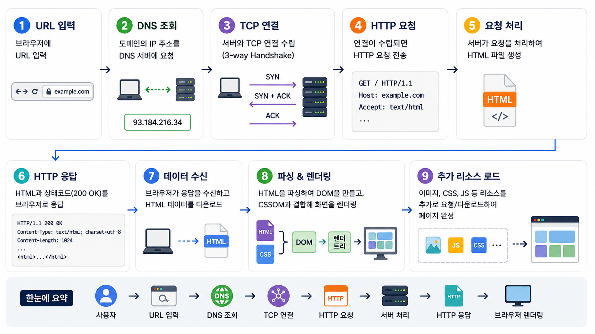

---

<!-- _class: full -->
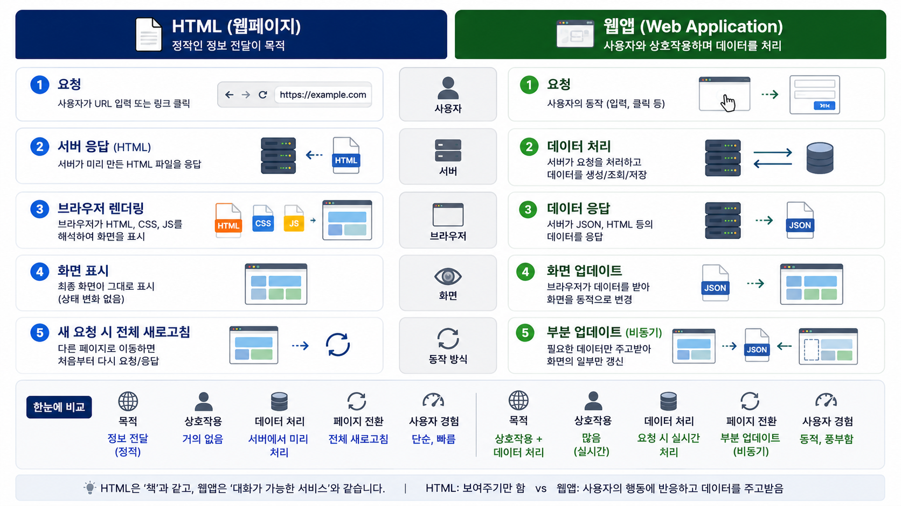

---

# 웹앱 MVP 개발 추천 스택

<div class="small-table">

| 구분 | 기술 | 추천 이유 |
|------|------|----------|
| Language | TypeScript | 안정적인 개발 |
| Framework | Next.js | 프론트 + API를 하나의 프로젝트에서 개발 |
| UI | Tailwind CSS | 빠른 UI 개발 |
| Component | shadcn/ui | 고품질 컴포넌트 |
| Database | Supabase PostgreSQL | 관리형 PostgreSQL |
| ORM | Prisma | 타입 안정성과 쉬운 DB 관리 |
| Authentication | Supabase Auth | 로그인 구현이 매우 쉬움 |
| Storage | Supabase Storage | 이미지/파일 업로드 |

</div>

---

# 웹앱 MVP 개발 추천 스택

<div class="small-table">

| 구분 | 기술 | 추천 이유 |
|------|------|----------|
| API | Server Actions / Route Handlers | 별도 백엔드 없이 API 구현 |
| Validation | Zod | 입력값 검증 |
| State | TanStack Query (필요 시) | 서버 상태 관리 |
| Deploy | Vercel | Git Push만으로 배포 |
| Monitoring | Vercel Analytics | 기본 성능 분석 |
| AI 연동 | OpenAI / Anthropic API | AI 기능 추가 |

</div>

---

# 사내 웹앱 MVP 개발 추천 스택

<div class="small-table">

| 구분 | 기술 | 추천 이유 |
|------|------|----------|
| Language | TypeScript | 안정적인 개발 |
| Framework | Next.js | 프론트 + API를 하나의 프로젝트에서 개발 |
| UI | Tailwind CSS + shadcn/ui | 빠른 UI 개발 |
| Database | SQLite | 단독 실행 가능한 소형 DB |
| ORM | drizzle orm + libsql | 서버 배포가 쉬움 |
| API | Server Actions / Route Handlers, Python | 별도 백엔드 없이 API 구현 |
| Deploy | Gitlab CI/CD | 자동 디플로이 |
| AI 연동 | H-Chat API | AI 기능 추가 |

</div>

---

<!-- _class: center -->

# <small>세션#3</small><br>**메모 웹앱 만들기**

--- 

# 이런 앱 만듭니다.

우리, 기억할게 너무 많자나요?

매일 쏟아지는 비밀번호, 유효기간, 주소, 메모, 할일 들

대신 기억해줄 간단한 메모 웹앱 만들어보겠습니다.

---

# 관리 폴더 생성

클로드는 보통 프로젝트 폴더를 미리 만들고 그 안에서 하나의 프로젝트를 진행합니다.

앞으로 만들 것들이 많으니 특정 폴더 아래 모아두는 것이 좋습니다.

```bat
mkdir C:\Users\0000000\Projects
```

---

# 프로젝트 이름을 추천 받아볼까요?

H-Chat 에 한번 물어보죠 

```
아래 목적의 웹앱을 만들려고 해. 서비스 이름과 프로젝트 코드 추천해줘.
---
우리, 기억할게 너무 많자나요?
매일 쏟아지는 비밀번호, 유효기간, 주소, 메모, 할일 들
대신 기억해줄 간단한 메모 웹앱 만들어보겠습니다.
```

전 서비스명으로 `잊지말자`와 프로젝트 코드 `dont-forget` 을 사용하겠습니다.

---

# 네이밍 규칙

<div class="small-table wrap-table">

| 명명 방식 | 예시  | 특징 | 주 사용처 |
|------------|-----------------------|------|-----------|
| **camelCase** | `dontForget` | 첫 단어는 소문자, 이후 단어 첫 글자만 대문자 | JavaScript/TypeScript 변수, 함수 |
| **PascalCase** | `DontForget` | 모든 단어의 첫 글자를 대문자로 작성 | 클래스, React 컴포넌트, C#/Java 타입 |
| **snake_case** | `dont_forget` | 단어를 언더스코어(`_`)로 구분 | Python 변수, 함수, 파일명 |
| **kebab-case** | `dont-forget` | 단어를 하이픈(`-`)으로 구분 | GitHub 저장소, URL, npm 패키지, Docker 이미지 |

</small>

---

# 프로젝트 폴더 생성

클로드는 보통 프로젝트 폴더를 미리 만들고 그 안에서 하나의 프로젝트를 진행합니다.

앞으로 만들 것들이 많으니 특정 폴더 아래 모아두는 것이 좋습니다.

```bat
mkdir C:\Users\0000000\Projects\dont-fotget
```

---

# 요구사항 정리

**프롬프트**

```
웹앱 서비스를 만들려고 합니다. 
아래 요구사항을 보고 문서화 해주세요.
개발을 위해 추가로 정의 해야할 내용이 있다면 물어보세요.
---
비밀번호, 유효기간, 주소, 메모, 할일 등 간단한 메모 웹앱이 필요합니다.
```

---

# 문서 관리

알아서 `docs\` 아래에 문서를 만들지만, 
아니라면 이후 관리를 위해 문서는 모아 두는 것이 좋습니다.

문서가 많아지면 세부 폴더를 만들어 정리해달라고 요청하시면 됩니다.

```
확정된 방향:
- 서버 없음 - 브라우저 IndexedDB에만 저장, 오프라인/PWA
- 마스터 비밀번호로 잠금, 비밀번호 항목은 AES-GCM 암호화
- 유효기간 만료 임박 시 앱 내 색상 배지로 표시
- 5가지 항목 타입: 비밀번호, 유효기간, 주소, 메모, 할일
```

---

# 자꾸 멀 물어봅니다.

AI Agent 는 폴더를 생성하고 파일을 지우고 많은 권한을 갖고 있습니다.
자꾸 물어보면 아래처럼 퍼미션 허용하는 방법을 물어보고 조치합니다.

```
기본 모드를 바이패스모드로 변경해주세요.
```

귀참음이 위험 부담을 이겼습니다.
**단, 아무도 책임져주지 않습니다!**

---

# 클로드 vs 클로드코드

<div class="small-table">

| 구분 | Claude | Claude Code |
|---|---|---|
| **형태** | 웹/모바일/데스크톱 채팅 인터페이스 | 터미널에서 실행되는 CLI 에이전트 |
| **주요 용도** | 대화, 글쓰기, 분석, 일반 질의응답 | 코딩, 디버깅, 리팩토링, 코드베이스 작업 |
| **파일/코드 접근** | 업로드 파일, artifacts 내 코드 작성 | 로컬 파일 시스템에 직접 접근해 실제 코드 수정·실행 |
| **명령 실행** | 불가 (자체 샌드박스 내에서만) | 셸 명령, 테스트, 빌드 등 실제 실행 가능 |
| **메모리 방식** | 대화 기록 + 메모리 시스템 | 프로젝트의 `CLAUDE.md` 파일로 지속 관리 |

---

# 클로드코드 주요 개념

<div class="small-table">

| 개념 | 설명 |
|---|---|
| **에이전트 루프** | 컨텍스트 수집 → 작업 수행 → 결과 검증의 3단계 반복 |
| **CLAUDE.md** | 프로젝트 개요·명령어·구조를 담아 자동으로 불러오는 메모리 파일 |
| **Plan Mode** | 수정 전 분석·계획을 먼저 세우고 승인받는 모드 (`/plan`) |
| **권한(Permissions)** | 명령 실행·파일 수정 시 사용자 승인 요청, `settings.json`으로 제어 |
| **확장 기능** | Skills, MCP, Hooks, Subagents로 기능 확장 |

---

# 클로드코드 확장 기능

<div class="small-table">

| 확장 기능 | 설명 |
|---|---|
| **Skills** | Claude에게 특정 작업 수행에 필요한 지식·절차를 추가 |
| **MCP (Model Context Protocol)** | 외부 서비스(DB, Slack, GitHub 등)와 연결해 데이터·기능 활용 |
| **Hooks** | 특정 이벤트 발생 시 자동으로 스크립트 실행 |
| **Subagents** | 하위 작업을 별도의 에이전트에게 위임해 병렬·전문화 처리 |

---

# 클로드코드 치트시트

https://support.claude.com/ko/articles/14553413-claude-code-%EC%B9%98%ED%8A%B8%EC%8B%9C%ED%8A%B8

용어집, 명령어, 단축키 등을 확인할 수 있습니다.

---

# 요구사항 검토

제 경우에 주소 유형을 실제 도로명/지번 주소로 생각했네요.
수정이 필요한 부분을 모두 수정 요청 합니다.

```
요구사항 중 "주소록" 은 삭제하고, URL 북마크로 기능 변경해줘.
```

디자인 등의 추가 요구사항이 있으면 요청합니다.

```
다크모드를 기본으로하고, 브라우저 실행하지 않고 사용할 수 있게해줘.
프로그램 사이즈에 따라 UI가 자동으로 변했으면 좋겠어.
모바일에서도 사용할 수 있으면 좋겠어.
```

---

# 설계 문서 작성

```
당신은 웹앱 서비스 설계자이며, 시니어 프론트엔드/보안 아키텍트다.
먼저 제공한 문서를 읽고, 바로 설계를 진행하지 말고 부족한 정보를 
질문하면서 설계를 구체화해라.

잔행 방식
1. 요구사항문서 (docs\REQUIREMENTS.md) 분석하라.
2. 요구사항 내 불명확한 정보 확인하라.
4. 불명확한 내용은 단계별로 질문하고, 선택지를 제공해라.
5. 답변을 반영해 설계 방향을 확정한다.
6. 모든 의사 결정이 끝나면 최종 설계 문서를 작성하라.
7. 모듈 별로 개발 진행되도록 단계를 구분하라.
```

참, 프롬프트는 두괄식이 좋다합니다.

---

# 설계 문서 작성

아니면 아래처럼 프롬프트 자체를 요청해도 좋습니다.

```
요구사항을 정리한 파일을 보고 질문과 답변을 통해 설계를 
확정하도록 지시하는 프롬프트 말들어줘.
```

AI를 “문서 생성기”가 아니라 “설계 리뷰어이자 아키텍트” 역할로 전환합니다.

---

# 개발 진행합니다.

설계 문서를 열어서 보고 ... 개발 시작합니다.

전체 진행 과정은 아래 페이지에 잘 정리되어있습니다.

https://roadmap.sh/vibe-coding 

---

# 소스 형상 관리

---

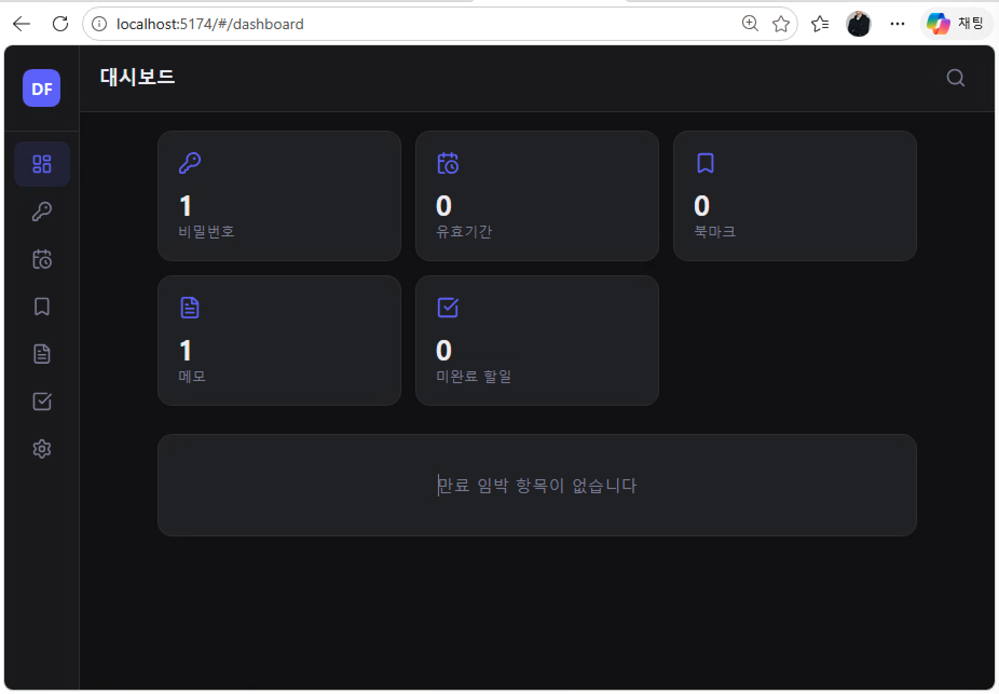

# 실행합니다.

문제는 결과가 매번 다릅니다.

---

# Pi Coding Agent

웹앱 개발에서 수정 범위를 지정하는 것은 pi-annotate가 좋습니다. **만.**

```
npm install -g --ignore-scripts @earendil-works/pi-coding-agent
```

```
https://pi.dev/docs/latest/providers 참고해서 
윈도우에서 사내 endpoint 로 붙일 provider 만들어줘
```

VDI에서는 못 씁니다.

---

# models.json

```
{
  "providers": {
    "gpt-5.4": {
      "baseUrl": "https://internal-apigw-kr.hmg-corp.io/hchat-in/api/v3/openai",
      "apiKey": "",
      "api": "openai-completions",
      "models": [
        {
          "id": "gpt-5.4",
          "name": "gpt-5.4"
        }
      ]
    }
  }
}
```

---

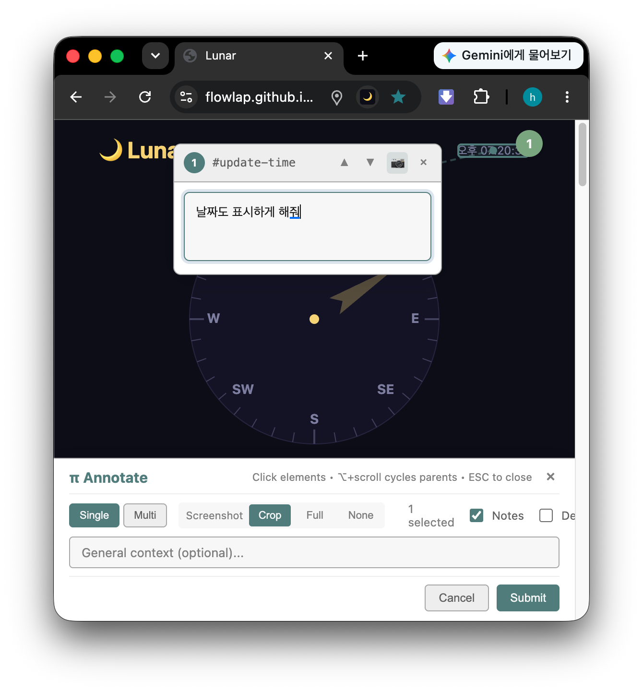

# pi-annotate

브라우저에서 HTML 요소를 선택하고 
Annotation을 남길 수 있습니다.

---
<!-- _class: center -->

# <small>세션#4</small><br>**사내 서비스 연동**

---

# AI 쿡북 만들기

여러 AI 도구를 만들 때 자주 쓰는 기능들을 만들어보겠습니다.

* AI API
* 이미지 AI API
* 컨플루언스 API
* 외부 검색 API
* 스케줄 걸기

---

# 프롬프트

```
사내 웹앱 개발 시 자주 쓰이는 기능들을 유틸리티로 만듭니다.
프로젝트명은 'AI Cookbook' 이며, projects 아래 폴더 만들어주세요.
이후 다른 프로젝트에서 코드를 참고할 수 있도록 사용법을 코드에 남겨주세요.
주요 기능 개발은 Phase2 에서 진행합니다. 

- 주요 기능: AI 채팅, Confluence 검색
- 기술 스택: Next.js, ShadCN
```

---

# H-Chat 연동

```
AI쿡북 프로젝트에 AI 채팅 기능 개발합니다.

기능
- 사내 AI API 엔드포인트는 3개의 모델을 제공합니다.
- 사용자는 채팅 시 모델을 고를 수 있습니다.
- 프롬프트 결과를 보여줍니다.
- H-Chat API KEY 는 .env 설정 파일로 관리합니다.

정보
- Endpoint: https://internal-apigw-kr.hmg-corp.io/hchat-in/api/v3
- 모델: gpt-5.4, claude-sonnet-4.6, gemini-3.1-pro-preview
```
---

# H-Chat 연동

* 이미지 생성 전용 모델
  * gemini-3-pro-image-preview
* 임베딩 모델
  * 성능이 매우 좋은 것으로 알...

---

# Confluence 연동

```
AI쿡북 프로젝트에 컨플루언스 검색 기능을 개발합니다.

기능
- 컨플루언스 스페이스를 검색합니다.
- 컨플루언스 문서를 검색합니다.
- 검색 결과를 보여줍니다.
- API KEY 는 설정파일로 관리합니다.

정보
- API 주소: https://confluence.hmg-corp.io
- 인증 방식: Bearer
```

---

<!-- _class: center -->

# <small>세션#5</small><br>**기존 업무 활용 방안**

---

# 프로젝트 - 관리

* 회의록 작성
* 컨플루언스 문서 관리
* 개발생산성 관리

---

# 프로젝트 - 개발

* LLM Wiki 사용
* DB-Entity-DAO-Model 연관관계 추적
* DB 튜닝 권고
* 코드 자동 리뷰
* BP 코드 기반 수정 개발 
* 다국어 처리 

---

<!-- _class: center -->

# <small>세션#6</small><br>**나만의 비서 만들기**

---

# Hermes

* 24시간 운영되는 PC에 Hermes Agent로 쟈비스 흉내
* 저렴한 VPC or 애플 맥 미니에서 구동
* 연산은 API 로 하고 정해진 프로그램만 구동하므로 저사양으로 운영 가능
* 텔레그램, Slack 연동을 기본으로 지원

---

# 자동화 

* 날씨 알림
* API 사용량 알림
* 메일 보관 처리
* 옵시디언 Clipping 처리
* 버스 알림

---

# 앱 찍어내기

> Next.js + Vercel + Supabase

* 앱 개발 스타터 팩
* 바이브 코딩으로 앱 출시까지 논스톱

---

# 트랜드 읽기

* 조쉬의 뉴스레터
* 한빛 데브레터
* 박재홍의 실리콘밸리
* 미쿡엔지니어의 실리콘밸리 인사이트
* GeekNews Weekly

---

<!-- _class: center -->

# 수고하셨습니다.

