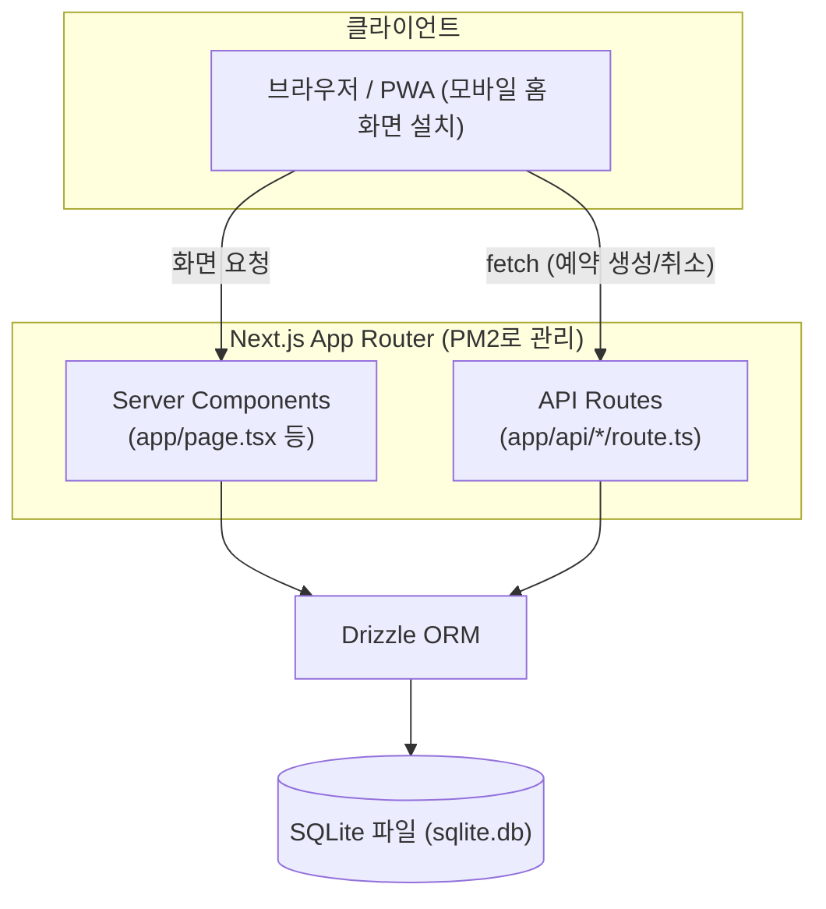

# 다이어그램 — 서비스 아키텍처 개요

> [00-강의개요](../docs/00-강의개요.md) 5절(기술 스택), [04-개발](../docs/04-개발.md), [05-배포](../docs/05-배포.md)를 시각화한 버전입니다.

## 왜 이렇게 단순한 구조인가

- 별도 백엔드 서버 없이 Next.js API Routes가 백엔드 역할까지 겸함 → 오늘 하루 안에 배포까지 완주 가능한 핵심 이유 ([00-강의개요](../docs/00-강의개요.md) 5절)
- SQLite는 파일 하나로 동작 → 별도 DB 서버 설치/네트워크 설정 불필요 (사외망 환경에 유리)
- PM2는 이 전체 Next.js 프로세스 하나를 감싸서 재시작/로그를 관리 ([05-배포](../docs/05-배포.md))

## 실무 전환 시 고려할 것

이 구조를 실제 다중 사용자 서비스로 키우려면 [10-best-practices](../docs/10-best-practices.md) 6절(보안)과 함께, SQLite → 서버형 DB 전환, 인증 계층 추가 등을 검토해야 합니다.
