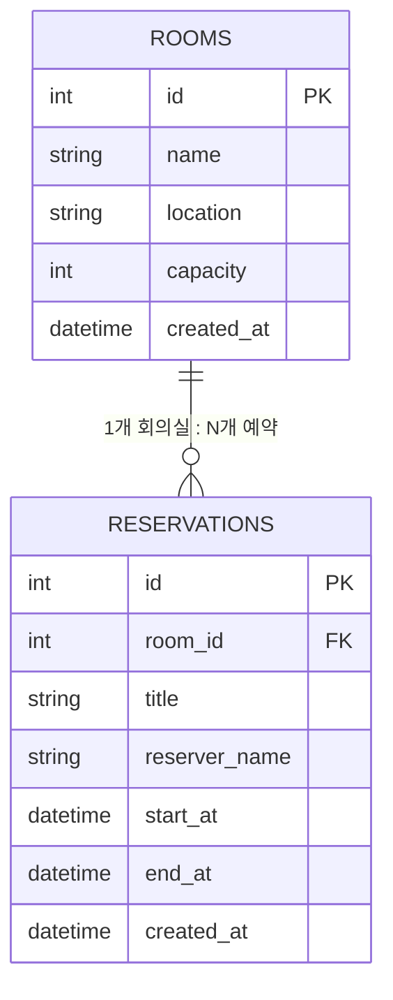

# 다이어그램 — Room Booking ERD

> [07-실습프로젝트](../docs/07-실습프로젝트.md) 5절, [03-설계](../docs/03-설계.md) 강사 기준안을 시각화한 버전입니다.



## 핵심 제약 조건 (다이어그램에 표현되지 않는 부분)

ERD는 테이블 구조만 보여줄 뿐, **중복 예약 방지 로직**은 애플리케이션 레벨에서 구현해야 합니다.

```
같은 room_id를 가진 두 예약 A(기존), B(신규)가 겹친다고 판단하는 조건:

A.start_at < B.end_at  AND  A.end_at > B.start_at
```

이 조건은 그림으로 표현하기보다 [04-개발](../docs/04-개발.md)에서 배운 것처럼 **수식과 예시로 AI에게 명확히 전달**하는 것이 훨씬 정확합니다. → [12-ai-prompt-patterns](../docs/12-ai-prompt-patterns.md) 패턴 2 참고.
