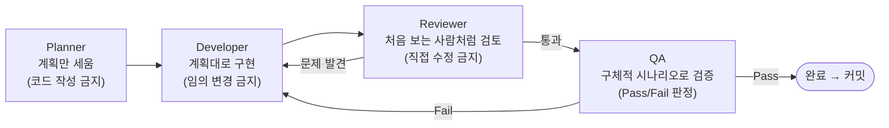

# 다이어그램 — Hermes Agent 역할 흐름

> [20-hermes-agent](../docs/20-hermes-agent.md)를 시각화한 버전입니다.

## 이 흐름에서 반복이 중요한 이유

Reviewer나 QA에서 문제가 발견되면 **Developer로 되돌아가는 것이 정상**입니다. 한 번에 통과하지 못했다고 실패가 아니라, 이 되돌림 루프 자체가 실무 개발 프로세스와 동일합니다.

> **강사 멘트 재인용** ([20-hermes-agent](../docs/20-hermes-agent.md)): "같은 사람이라도 Reviewer 모드로 전환해 지시하면 AI의 응답 태도가 실제로 달라지는 것을 경험했을 것입니다."
