# 다이어그램 — 하루 전체 타임테이블

> [00-강의개요](../docs/00-강의개요.md) 6절의 표를 시각화한 버전입니다.

```mermaid
gantt
    title Claude Code + AI Agent 바이브 코딩 실습 (09:00~17:00)
    dateFormat  HH:mm
    axisFormat  %H:%M

    section 오전
    오리엔테이션 (01)      :a1, 09:00, 80m
    분석 (02)              :a2, 10:30, 60m
    설계 (03)              :a3, 11:30, 60m
    점심                   :lunch, 12:30, 60m

    section 오후
    개발 (04)              :a4, 13:30, 120m
    배포 (05)              :a5, 15:40, 40m
    Hermes Agent (20)      :a6, 16:20, 30m
    회고                   :a7, 16:50, 10m
```

## 읽는 법

- 실습(70% 이상)은 각 세션 안에서 "설명 → 강사 시연 → 학생 실습 → AI 활용 → 정리"로 다시 세분화됩니다. 세션별 상세 분(分) 단위 일정은 각 세션 문서의 "세부 일정" 표를 참고하세요.
- `04-개발`이 전체 콘텐츠 시간(400분) 중 120분으로 가장 큰 비중을 차지합니다 — 강사는 이 블록의 시간 관리에 가장 신경 써야 합니다 ([08-강사용노트](../docs/08-강사용노트.md) 참고).
